# Manchester Digital Boot Camp List

Boot camps are delivered roughly monthly as part of the Manchester Digital Level 4 Software Developer apprenticeship. They provide targetted ‘off-the-job’ learning for apprentices to supplement the experience they get ‘on-the-job’ at their employer.

The boot camps are delivered by facilitators from various employer companies. The aim is that the supporting material is stored in this GitHub organisation, to facilitate collaboration and future accessibility.

## Available Boot Camps
This page has a list of the boot camps in the order they are currently delivered.

| Name                                                                                                                 | Facilitators             | Lead employer | KSBs (not exhaustive) ([what are these?](https://www.instituteforapprenticeships.org/apprenticeship-standards/software-developer-v1-1#K1))  |
|----------------------------------------------------------------------------------------------------------------------|--------------------------|---------------|-------------------------|
| [Fundamentals 1](https://github.com/MCR-Digital/apprentice-boot-camp-fundamentals-1)                                 | @mrmanc & @alectunbridge | Auto Trader   | [K7](https://github.com/search?q=org%3AMCR-Digital+topic%3Aksb-k7), [K11](https://github.com/search?q=org%3AMCR-Digital+topic%3Aksb-k11), [S1](https://github.com/search?q=org%3AMCR-Digital+topic%3Aksb-s1), [S8](https://github.com/search?q=org%3AMCR-Digital+topic%3Aksb-s8), [S11](https://github.com/search?q=org%3AMCR-Digital+topic%3Aksb-s11), [S12](https://github.com/search?q=org%3AMCR-Digital+topic%3Aksb-s12) |
| [Fundamentals 2](https://github.com/MCR-Digital/apprentice-boot-camp-fundamentals-2)                                 | @mrmanc & @alectunbridge | Auto Trader   | [K7](https://github.com/search?q=org%3AMCR-Digital+topic%3Aksb-k7), [S1](https://github.com/search?q=org%3AMCR-Digital+topic%3Aksb-s1), [S4](https://github.com/search?q=org%3AMCR-Digital+topic%3Aksb-s4), [S6](https://github.com/search?q=org%3AMCR-Digital+topic%3Aksb-s6), [S7](https://github.com/search?q=org%3AMCR-Digital+topic%3Aksb-s7), [S9](https://github.com/search?q=org%3AMCR-Digital+topic%3Aksb-s9) |
| [Fundamentals 3](https://github.com/MCR-Digital/apprentice-boot-camp-fundamentals-3)                                 | @mrmanc & @alectunbridge | Auto Trader   | [S1](https://github.com/search?q=org%3AMCR-Digital+topic%3Aksb-s1), [S4](https://github.com/search?q=org%3AMCR-Digital+topic%3Aksb-s4), [S10](https://github.com/search?q=org%3AMCR-Digital+topic%3Aksb-s10), [S12](https://github.com/search?q=org%3AMCR-Digital+topic%3Aksb-s12), [S14](https://github.com/search?q=org%3AMCR-Digital+topic%3Aksb-s14) |
| [UX Design Analysis](https://github.com/MCR-Digital/apprentice-boot-camp-ux-design-analysis)                         |                          | ?             | [S2](https://github.com/search?q=org%3AMCR-Digital+topic%3Aksb-s2), [S9](https://github.com/search?q=org%3AMCR-Digital+topic%3Aksb-s9)                  |
| [System and Database Design](https://github.com/MCR-Digital/Bootcamp-8-Systems-and-Database-Design)                  |                          | Coop          | [K11](https://github.com/search?q=org%3AMCR-Digital+topic%3Aksb-k11), [S8](https://github.com/search?q=org%3AMCR-Digital+topic%3Aksb-s8)                 |
| [Databases](https://github.com/MCR-Digital/apprentice-boot-camp-databases)                                           | @Tom-S82                 | Zuto          | [K10](https://github.com/search?q=org%3AMCR-Digital+topic%3Aksb-k10), [S3](https://github.com/search?q=org%3AMCR-Digital+topic%3Aksb-s3)                 |
| [Testing Pyramid](https://github.com/MCR-Digital/apprentice-bootcamp-testing-pyramid)                                |                          | Coop          | [K12](https://github.com/search?q=org%3AMCR-Digital+topic%3Aksb-k12), [S4](https://github.com/search?q=org%3AMCR-Digital+topic%3Aksb-s4), [S5](https://github.com/search?q=org%3AMCR-Digital+topic%3Aksb-s5), [S6](https://github.com/search?q=org%3AMCR-Digital+topic%3Aksb-s6), [S13](https://github.com/search?q=org%3AMCR-Digital+topic%3Aksb-s13)    |
| [Delivery](https://github.com/MCR-Digital/bootcamp-delivery)                                                         | @tomdaly, @ameliamyfanwy, @jameshd, @graemelindsayBBC, @sbeaumontweb | BBC           | [S10](https://github.com/search?q=org%3AMCR-Digital+topic%3Aksb-s10), [S14](https://github.com/search?q=org%3AMCR-Digital+topic%3Aksb-s14), [S17](https://github.com/search?q=org%3AMCR-Digital+topic%3Aksb-s17)           |
| [Hack Day](https://github.com/MCR-Digital/apprentice-hack-day)                                                       |                          | ?             |                         |
| [Improving Code](https://github.com/MCR-Digital/apprentice-boot-camp-improving-code) (AKA Working with Legacy Code)  | @mrmanc & @alectunbridge | Auto Trader   | [S1](https://github.com/search?q=org%3AMCR-Digital+topic%3Aksb-s1), [S8](https://github.com/search?q=org%3AMCR-Digital+topic%3Aksb-s8), [S11](https://github.com/search?q=org%3AMCR-Digital+topic%3Aksb-s11), [S12](https://github.com/search?q=org%3AMCR-Digital+topic%3Aksb-s12), [S14](https://github.com/search?q=org%3AMCR-Digital+topic%3Aksb-s14), [S15](https://github.com/search?q=org%3AMCR-Digital+topic%3Aksb-s15), [B4](https://github.com/search?q=org%3AMCR-Digital+topic%3Aksb-b4) |
| [Methodologies](https://github.com/MCR-Digital/apprentice-boot-camp-methodologies)                                   |                          | Waters        | [K1](https://github.com/search?q=org%3AMCR-Digital+topic%3Aksb-k1), [K2](https://github.com/search?q=org%3AMCR-Digital+topic%3Aksb-k2), [K4](https://github.com/search?q=org%3AMCR-Digital+topic%3Aksb-k4), [K5](https://github.com/search?q=org%3AMCR-Digital+topic%3Aksb-k5), [K6](https://github.com/search?q=org%3AMCR-Digital+topic%3Aksb-k6), [S12](https://github.com/search?q=org%3AMCR-Digital+topic%3Aksb-s12) |
| [Portfolio Masterclass](https://github.com/MCR-Digital/apprentice-boot-camp-portfolio) (AKA Core Skills 1)           |                          | MCR Digital   |                         |
| [End point assessment](https://github.com/MCR-Digital/apprentice-boot-camp-end-point-assessment) (AKA Core Skills 2) |                          | MCR Digital   | [K8](https://github.com/search?q=org%3AMCR-Digital+topic%3Aksb-k8), [S15](https://github.com/search?q=org%3AMCR-Digital+topic%3Aksb-s15), [B3](https://github.com/search?q=org%3AMCR-Digital+topic%3Aksb-b3), [B4](https://github.com/search?q=org%3AMCR-Digital+topic%3Aksb-b4), [B5](https://github.com/search?q=org%3AMCR-Digital+topic%3Aksb-b5), [B7](https://github.com/search?q=org%3AMCR-Digital+topic%3Aksb-b7) |

### Boot camps by KSB

```mermaid
%%{init: {'themeVariables': { 'fontSize': '10px'}}}%%
graph LR

subgraph Knowledge
K1
K2
k3
K4
K5
K6
K7
K8
K9
K10
K11
K12
end

subgraph Skills
S1
S2
S3
S4
S5
S6
S7
S8
S9
S10
S11
S12
S13
S14
S15
S16
S17
end

subgraph Behaviours
B1
B2
B3
B4
B5
B6
B7
B8
B9
end

subgraph Boot camps
Fundamentals_1
Fundamentals_2
Fundamentals_3
Databases
Delivery
End_point_assessment
Improving_Code
Methodologies
System_and_Database_Design
Testing_Pyramid
UX_Design_Analysis
end

Fundamentals_1-->K7
Fundamentals_1-->K11
Fundamentals_1-->S1
Fundamentals_1-->S8
Fundamentals_1-->S11
Fundamentals_1-->S12
Fundamentals_2-->K7
Fundamentals_2-->S1
Fundamentals_2-->S4
Fundamentals_2-->S6
Fundamentals_2-->S7
Fundamentals_2-->S9
Fundamentals_3-->S1
Fundamentals_3-->S4
Fundamentals_3-->S10
Fundamentals_3-->S12
Fundamentals_3-->S14
UX_Design_Analysis-->S2
UX_Design_Analysis-->S9
System_and_Database_Design-->K11
System_and_Database_Design-->S8
Databases-->K10
Databases-->S3
Testing_Pyramid-->K12
Testing_Pyramid-->S4
Testing_Pyramid-->S5
Testing_Pyramid-->S6
Testing_Pyramid-->S13
Delivery-->S10
Delivery-->S14
Delivery-->S17
Improving_Code-->S1
Improving_Code-->S8
Improving_Code-->S11
Improving_Code-->S12
Improving_Code-->S14
Improving_Code-->S15
Improving_Code-->B4
Methodologies-->K1
Methodologies-->K2
Methodologies-->K4
Methodologies-->K5
Methodologies-->K6
Methodologies-->S12
End_point_assessment-->K8
End_point_assessment-->S15
End_point_assessment-->B3
End_point_assessment-->B4
End_point_assessment-->B5
End_point_assessment-->B7
```

#### Knowledge

* [K1: all stages of the software development life-cycle (what each stage contains, including the inputs and outputs)](https://github.com/search?q=org%3AMCR-Digital+topic%3Aksb-k1)
* [K2: roles and responsibilities within the software development lifecycle (who is responsible for what)](https://github.com/search?q=org%3AMCR-Digital+topic%3Aksb-k2)
* [K3: the roles and responsibilities of the project life-cycle within your organisation, and your role](https://github.com/search?q=org%3AMCR-Digital+topic%3Aksb-k3)
* [K4: how best to communicate using the different communication methods and how to adapt appropriately to different audiences](https://github.com/search?q=org%3AMCR-Digital+topic%3Aksb-k4)
* [K5: the similarities and differences between different software development methodologies, such as agile and waterfall.](https://github.com/search?q=org%3AMCR-Digital+topic%3Aksb-k5)
* [K6: how teams work effectively to produce software and how to contribute appropriately](https://github.com/search?q=org%3AMCR-Digital+topic%3Aksb-k6)
* [K7: software design approaches and patterns, to identify reusable solutions to commonly occurring problems](https://github.com/search?q=org%3AMCR-Digital+topic%3Aksb-k7)
* [K8: organisational policies and procedures relating to the tasks being undertaken, and when to follow them. For example the storage and treatment of GDPR sensitive data.](https://github.com/search?q=org%3AMCR-Digital+topic%3Aksb-k8)
* [K9: algorithms, logic and data structures relevant to software development for example:- arrays- stacks- queues- linked lists- trees- graphs- hash tables- sorting algorithms- searching algorithms- critical sections and race conditions](https://github.com/search?q=org%3AMCR-Digital+topic%3Aksb-k9)
* [K10: principles and uses of relational and non-relational databases](https://github.com/search?q=org%3AMCR-Digital+topic%3Aksb-k10)
* [K11: software designs and functional or technical specifications](https://github.com/search?q=org%3AMCR-Digital+topic%3Aksb-k11)
* [K12: software testing frameworks and methodologies](https://github.com/search?q=org%3AMCR-Digital+topic%3Aksb-k12)

#### Skills

* [S1: create logical and maintainable code](https://github.com/search?q=org%3AMCR-Digital+topic%3Aksb-s1)
* [S2: develop effective user interfaces](https://github.com/search?q=org%3AMCR-Digital+topic%3Aksb-s2)
* [S3: link code to data sets](https://github.com/search?q=org%3AMCR-Digital+topic%3Aksb-s3)
* [S4: test code and analyse results to correct errors found using unit testing](https://github.com/search?q=org%3AMCR-Digital+topic%3Aksb-s4)
* [S5: conduct a range of test types, such as Integration, System, User Acceptance, Non-Functional, Performance and Security testing.](https://github.com/search?q=org%3AMCR-Digital+topic%3Aksb-s5)
* [S6: identify and create test scenarios](https://github.com/search?q=org%3AMCR-Digital+topic%3Aksb-s6)
* [S7: apply structured techniques to problem solving, debug code and understand the structure of programmes in order to identify and resolve issues](https://github.com/search?q=org%3AMCR-Digital+topic%3Aksb-s7)
* [S8: create simple software designs to effectively communicate understanding of the program](https://github.com/search?q=org%3AMCR-Digital+topic%3Aksb-s8)
* [S9: create analysis artefacts, such as use cases and/or user stories](https://github.com/search?q=org%3AMCR-Digital+topic%3Aksb-s9)
* [S10: build, manage and deploy code into the relevant environment](https://github.com/search?q=org%3AMCR-Digital+topic%3Aksb-s10)
* [S11: apply an appropriate software development approach according to the relevant paradigm (for example object oriented, event driven or procedural)](https://github.com/search?q=org%3AMCR-Digital+topic%3Aksb-s11)
* [S12: follow software designs and functional or technical specifications](https://github.com/search?q=org%3AMCR-Digital+topic%3Aksb-s12)
* [S13: follow testing frameworks and methodologies](https://github.com/search?q=org%3AMCR-Digital+topic%3Aksb-s13)
* [S14: follow company, team or client approaches to continuous integration, version and source control](https://github.com/search?q=org%3AMCR-Digital+topic%3Aksb-s14)
* [S15: communicate software solutions and ideas to technical and non-technical stakeholders](https://github.com/search?q=org%3AMCR-Digital+topic%3Aksb-s15)
* [S16: apply algorithms, logic and data structures](https://github.com/search?q=org%3AMCR-Digital+topic%3Aksb-s16)
* [S17: interpret and implement a given design whist remaining compliant with security and maintainability requirements](https://github.com/search?q=org%3AMCR-Digital+topic%3Aksb-s17)

#### Behaviours

* [B1: Works independently and takes responsibility. For example, has a disciplined and responsible approach to risk and stays motivated and committed when facing challenges](https://github.com/search?q=org%3AMCR-Digital+topic%3Aksb-B1)
* [B2: Applies logical thinking. For example, uses clear and valid reasoning when making decisions related to undertaking work instructions](https://github.com/search?q=org%3AMCR-Digital+topic%3Aksb-B2)
* [B3: Maintains a productive, professional and secure working environment](https://github.com/search?q=org%3AMCR-Digital+topic%3Aksb-B3)
* [B4: Works collaboratively with a wide range of people in different roles, internally and externally, with a positive attitude to inclusion & diversity](https://github.com/search?q=org%3AMCR-Digital+topic%3Aksb-B4)
* [B5: Acts with integrity with respect to ethical, legal and regulatory ensuring the protection of personal data, safety and security.](https://github.com/search?q=org%3AMCR-Digital+topic%3Aksb-B5)
* [B6: Shows initiative and takes responsibility for solving problems within their own remit, being resourceful when faced with a problem to solve.](https://github.com/search?q=org%3AMCR-Digital+topic%3Aksb-B6)
* [B7: Communicates effectively in a variety of situations to both a technical and non-technical audience.](https://github.com/search?q=org%3AMCR-Digital+topic%3Aksb-B7)
* [B8: Shows curiosity to the business context in which the solution will be used, displaying an inquisitive approach to solving the problem. This includes the curiosity to explore new opportunities, techniques and the tenacity to improve methods and maximise performance of the solution and creativity in their approach to solutions.](https://github.com/search?q=org%3AMCR-Digital+topic%3Aksb-B8)
* [B9: Committed to continued professional development.](https://github.com/search?q=org%3AMCR-Digital+topic%3Aksb-B9)

## Creating boot camp resources

There is an [apprentice-boot-camp-template](https://github.com/MCR-Digital/apprentice-boot-camp-template) which acts as a starting point for any new boot camp material. It includes a starting point for creating slides using Markdown (Slides As Code) which are converted to reveal.js HTML slides. We prefer this approach as it is easier for people to collaborate with pull requests, and working together without having to negotiate how to share Powerpoint files. We also get the benefits of version control which makes us feel that our content is safer.

## Mentoring boot camps

Since our apprentices work in a variety of languages and in a variety of organisations, it’s both necessary and really beneficial for them to have input from people in different backgrounds. Most of our boot camps involve coding exercises. The people facilitating the boot camp are rarely equipped to provide expert advice to the apprentices about each of these languages. So we try to have experts in each language available to support the apprentices while they carry out these exercises. Mentoring is a fantastic opportunity to practice skills which you might not be able to exercise back in the office.

As a mentor you can expect to assist with both days (ideally) of a boot camp. You may be involved in a one hour planning call a few weeks before the boot camp, while the preparations are still being made. You should also be involved in a boot camp run through, where you will find out more about the practical exercises that you will be supporting. This is useful so that they aren’t new to you on the day of the boot camp.

You’ll join the boot camp around 9am (slightly earlier than the apprentices) so that any last minute discussions can happen, and so that everyone is present when the apprentices join. The boot camp will likely have sections of presentation. You may be familiar with the content already. Feel free to do some admin / other tasks during these periods, but be ready for the exercises which should happen frequently. You’ll be supporting a specific group of apprentices, and they may have questions for you about how to approach a task or how to fix something that is blocking them. They will really benefit from the conversations they have with you, especially if you share your own point of view and listen to understand what it is they need from you.

While you don’t need to be super experienced, it is helpful if mentors have experience of supporting other inexperienced people. Ideally you’ll be familiar with coaching someone towards finding the answer themselves, rather than giving them the solution. The exercises are intended to reinforce the learning, and give them an opportunity to do some coding outside their usual environment. For remote boot camps, we try to have a mentor available for every two apprentices, and you’ll work on the exercises in a dedicated breakout room. For physical boot camps we are able to move around the room more easily and mentors can cover up to four apprentices each.

While the apprentices are working on exercises please be present to receive questions. When co-located, mingle with the group and find ways to invite yourself in by asking open questions like ‘how are you getting on?’ and ‘where are you up to?’ rather than closed questions like ‘do you need any help?’ (to which the answer will almost always be ‘no’). We regularly get feedback that apprentices have got loads out of a conversation with a mentor. A one-to-one conversation can be incredibly valuable.

At the end of each day, mentors will hang back for a quick debrief to discuss how the day has gone with the facilitators. This can be critical to shape the delivery of the next day, and often the next year. If you have useful feedback about the apprentices then note it down (with their name) as it can be useful for organisations to hear how their apprentices have negotiated the boot camp.
